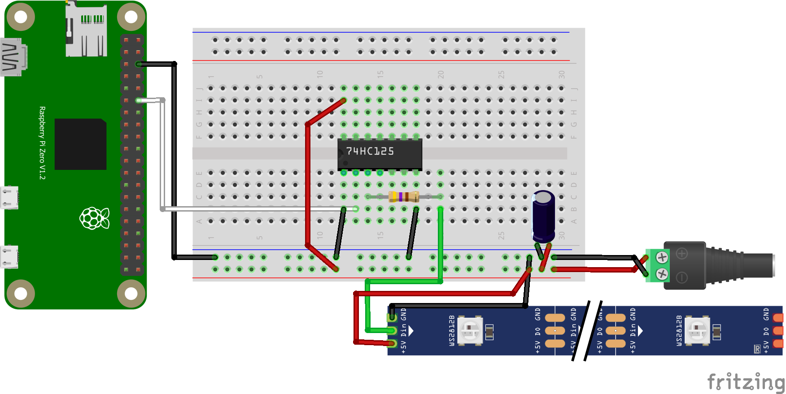
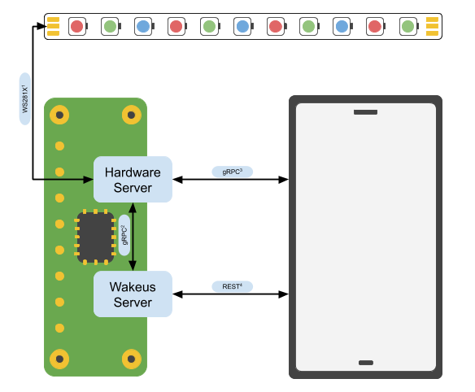

# Wakeus

A homemade wake up light designed to emulate the sunrise. The project contains three parts:
- Hardware server (Raspberry Pi Zero W + WS2812B LED strip + Python RPC server)
- Server (Golang API server + Golang RPC Client)
- Android (Client app + Kotlin RPC Client)

## Table of contents
1. [Getting Started](#getting-started)
1. [Components](#components)
1. [Raspberry Pi Zero W Headless Setup](#raspberry-pi-zero-w-headless-setup)
1. [Architecture](#architecture)

## Getting Started
1. Make sure you have set up the hardware [components](#components)
1. Make sure you have set the [pi](#raspberry-pi-zero-w-headless-setup)
1. Run
    ```bash
   # clone this repo
   cd $HOME
   git clone https://github.com/james-woo/wakeus.git
   cd wakus
   
   # run docker compose
   docker-compose up -d
   ```

The strip should perform a test.

## Components
Parts used in this project
- Raspberry Pi Zero W
- 5V WS2812X LED strip (WS2811, WS2812, WS2812B)
  - I would recommend the WS2812(B) strips because these strips have individually addressable LEDs (1 led/pixel)
  - WS2811 does not have individually addressable LEDs (3 leds/pixel)
  - These strips come in different densities (30 LEDs/m, 60 LEDs/m, etc.)
- Breadboard for prototyping
- Jumper wires (male to female)
- Jumper wires (male to male)
- Level shifter such as 74HC125 or CD4050, a buffer
  - converts Raspberry Pi 3.3V to LED strip 5V
- 5V DC Power supply
  - Amperage depends on number of LEDs the strip has
  - e.g. 1 LED can consume up to 60mA, if you have 60 LEDs that is 3.6A
- 470Ω resistor
- 1000µF capacitor

Here is what the initial prototype looks like.


### Wiring
Corresponding wiring diagram


## Raspberry Pi Zero W Headless Setup
Setup your Pi without a screen
1. Download [Raspian Stretch Lite](https://www.raspberrypi.org/downloads/raspbian/) ("lite" means no GUI)
1. Download [Etcher](https://etcher.io/)
1. Flash Raspbian onto MicroSD with Etcher
1. You should see a new device named `boot`
1. Enable SSH, in `boot` create a file called `ssh`
1. Enable Wifi, in `boot` create a file called `wpa_supplicant.conf` 
    ```bash
    # wpa_supplicant.conf
    country=CA
    ctrl_interface=DIR=/var/run/wpa_supplicant GROUP=netdev
    update_config=1
    
    network={
     ssid="WIFI_SSID"
     scan_ssid=1
     psk="WIFI_PASSWORD"
     key_mgmt=WPA-PSK
    }
    ```

    `ssh` and `wpa_supplicant.conf` are configuration files that allow you to pre-configure the Raspberry Pi. Specifically,
    these two allow the Raspberry Pi to do two things: 1. enable SSH, and 2. Enable Wifi. If you notice that these two files
    disappear when you read the SD card on your computer, that is normal, the Pi deletes these files after reading them on
    boot.
1. Insert the SD card into the Pi. If you have done everything right, you should now be able to SSH into the Pi
1. SSH into the pi: `ssh pi@raspberrypi.local` (recommend to disconnect any other Pi's you have on the local network)
1. Update your password and enable SSH
    ```bash
    sudo raspi-config
    ```
1. Update and install libraries
   ```bash
   sudo apt-get update && sudo apt-get upgrade && sudo apt-get install -y \
   apt-transport-https \
   ca-certificates \
   curl \
   gnupg2 \
   software-properties-common \
   libffi-dev \
   libssl-dev \
   python \
   python-pip
   
   # Add Docker GPG key for Raspbian
   curl -fsSL https://download.docker.com/linux/raspbian/gpg | sudo apt-key add -
   
   # Setup Docker repository
   echo "deb [arch=armhf] https://download.docker.com/linux/raspbian $(lsb_release -cs) stable" | sudo tee /etc/apt/sources.list.d/docker.list
   
   # Update package list
   sudo apt-get update
   
   # Install 18.06.2~ce~3-0~raspbian (Last known working version for Raspberry Pi Zero)
   sudo apt-get install -y docker-ce=18.06.2~ce~3-0~raspbian containerd.io
   
   # Add user to Docker group
   sudo usermod -aG docker $USER
   
   # Test
   sudo docker info
   sudo docker run arm32v5/hello-world
   
   # Install docker-compose
   sudo pip install docker-compose
   ```
   Note: I had to update my `root` password using `sudo passwd root`, and reboot

## Architecture

The project consists of three main parts as shown in the diagram below


The LED strip, Raspberry Pi Zero W, and a mobile device. Both the Pi and mobile device can communicate directly with the
hardware via RPC to perform any action the LED strip should perform. The mobile device can communicate directly with the
Wakeus server to perform basic CRUD operations for [Tasks](#task-api).

### Hardware Server
The hardware server's job is to recieve any remote procedure calls (RPC's) and perform any hardware related actions.

#### RPC Action API
Files generated using these commands:

- Go: `protoc --proto_path=proto --proto_path=vendor --go_out=plugins=grpc:server/rpc service.proto`
- Python: `python -m grpc_tools.protoc --proto_path=proto --python_out=plugins=grpc:hardware --grpc_python_out=./hardware service.proto`

Fade

Basic

### Wakeus Server
The primary purpose of this server is to provide a RESTful API around tasks created by the client.

#### Task API

`POST /task`

Input

| Name | Type | Description |
|------|------|-------------|
|      |      |             |
|      |      |             |
|      |      |             |

`GET /tasks`

`GET /task/:id`

`PUT /task/:id`

`DELETE /task/:id`

### Wakeus App

The primary purpose of the app is to provide the user the ability to set alarms, set tasks, or manual drive of the
hardware.

#### Features
